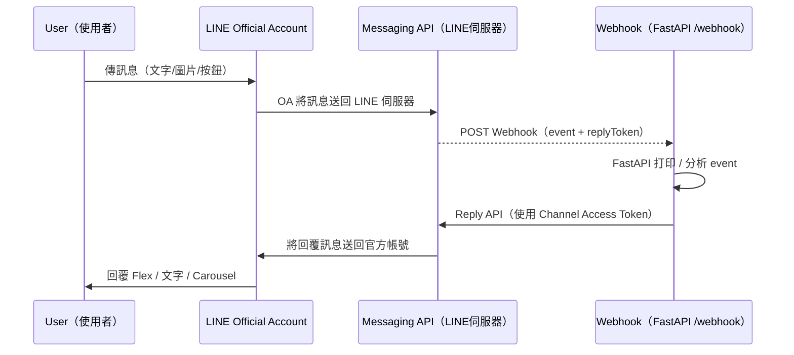
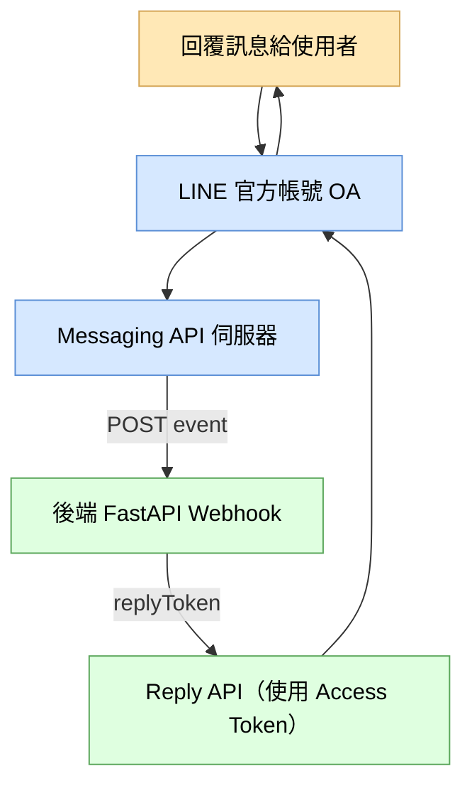
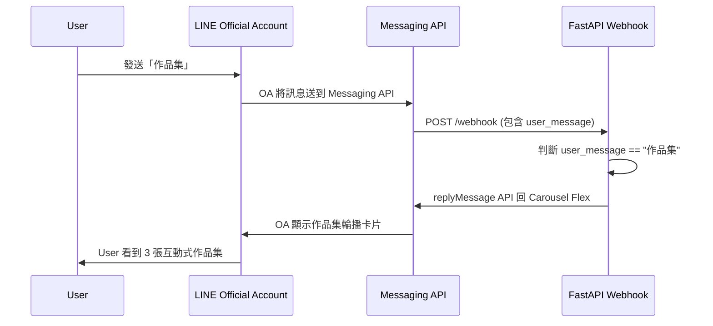
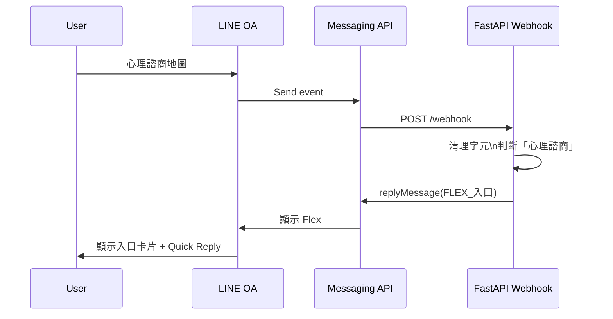

# 
- 這份文件比較像是自己做line oa的流程和進度筆記整理
- 下載poetry(練習使用)
- 使用fastapi

## 專案分層架構


## 流程

### 🚀 Day 1｜LINE OA × FastAPI Webhook 建置筆記
本日目標很單純：

> **成功讓 LINE OA → FastAPI → Terminal 印出 Webhook JSON**

---

## ✅ 1. 專案初始化（Poetry）

```bash
mkdir line_resume_fastapi
cd line_resume_fastapi

poetry init   # 全部按 Enter
poetry add fastapi uvicorn python-dotenv
poetry shell
```

---

## ✅ 2. 建立 `.env`

（Day 1 不用填 token，先留空也可以）

```
LINE_CHANNEL_ACCESS_TOKEN=
LINE_CHANNEL_SECRET=
PORT=3000
```

---

## ✅ 3. 建立 `main.py`（最小 Webhook）

```python
from fastapi import FastAPI, Request
import json
from dotenv import load_dotenv

load_dotenv()

app = FastAPI()

@app.get("/")
async def root():
    return {"message": "FastAPI LINE Bot is running"}

@app.post("/webhook")
async def webhook(request: Request):
    body = await request.json()
    print("\n=== 收到 LINE Webhook ===")
    print(json.dumps(body, indent=2, ensure_ascii=False))
    return {"status": "ok"}
```

---

## ✅ 4. 啟動 FastAPI

```bash
poetry run uvicorn main:app --reload --port 3000
```

看到：

```
Uvicorn running on http://127.0.0.1:3000
```

即代表成功。

---

## ✅ 5. 用 ngrok 暴露本地端

```bash
ngrok http 3000
```

Webhook URL：

```
https://xxxx.ngrok-free.app/webhook
```

---

## ✅ 6. LINE Developers後台按右上角『設定』-> Webhook API

Messaging API → Webhook：

- ✔ Use Webhook：ON  
- ✔ Webhook URL：貼上 ngrok  
- ✔ 點「Verify」 → 顯示 Success 即成功  

---

## ✅ 7. 使用者傳訊息 → Webhook 印出 JSON

在 LINE OA 中傳：

```
嗨
```

Terminal 會看到類似：

```json
{
  "destination": "Uxxxxxxxxxxxxxxxxxxxxxxxxxxxxxxxx",
  "events": [
    {
      "type": "message",
      "message": {
        "type": "text",
        "id": "589546408361852950",
        "quoteToken": "Usez7n....",
        "markAsReadToken": "niuC5A....",
        "text": "嗨"
      },
      "webhookEventId": "01KB238CV6257FEA8QCQ6JNY0M",
      "deliveryContext": {
        "isRedelivery": false
      },
      "timestamp": 1764228346647,
      "source": {
        "type": "user",
        "userId": "U92c1760389b70c9d967909e3ff68bced"
      },
      "replyToken": "1bc60121a7354411aca7655c08882e2e",
      "mode": "active"
    }
  ]
}
```

---

# 🧩 Webhook 回傳格式解析

## 🔹 `destination`
代表訊息送到哪個 bot（你的 Channel ID）。  
通常不用動它。

---

## 🔹 `events[]`
所有事件都包在這個 array。  
1 個訊息 = 1 個 event。

---

## 🔹 `type`
事件類型，例如：

- message（最常見）
- follow（加入好友）
- unfollow（封鎖）
- postback
- beacon
- memberJoined 等…

---

## 🔹 `message`
如果是文字訊息 → 包含：

| 欄位 | 意義 |
|------|------|
| `type` | text / image / sticker |
| `id` | message id |
| `text` | 使用者傳來的文字 |
| `quoteToken` | 用於引用訊息（新功能） |
| `markAsReadToken` | 標記訊息已讀 |

---

## 🔹 `replyToken`
**重要！你要回訊息必須用它。**

之後 Day 2 我們會用這個：

```python
{
  "replyToken": "xxxx",
  "messages": [...]
}
```

---

## 🔹 `source`
事件來源：

```json
"source": {
  "type": "user",
  "userId": "U92c1760389b70c9d967909e3ff68bced"
}
```

可能是：

- user  
- group  
- room  

---

## 🔹 `timestamp`
毫秒時間戳。

---

## 🔹 `mode`
active / standby  
（只有多 bot 設定才會用到）

---

# 🏁 Day 1 結論

已完成：
- FastAPI server 啟動  
- ngrok 外部轉發  
- Webhook 成功驗證  
- 能收到 LINE OA 全部資訊  

--- 

### Day 2｜互動履歷 Flex Message 完成 + LINE 三大金鑰完全解析（後端視角）

本日重點：

1. 完成互動履歷第一版 Flex 名片  
2. Reply API 成功回覆 Flex  
3. 完全理解 LINE 三大必備金鑰（ID / Secret / Access Token）  
4. 用 Mermaid 圖理解 Messaging API 與 FastAPI 的關係  

這篇是讓你未來不會再搞混 LINE 的任何金鑰，也是 Day 2 的正式紀錄。

---

# ✔️ Day 2 成果

- LINE OA → FastAPI → Webhook 事件成功接收  
- 「Reply API」成功發送 Flex Message  
- 互動履歷第一張「名片 Flex 卡」完成  
- Messaging API 設定正確  
- 完成了整個互動履歷作品集的「首頁」

---

# ✔️ Day 2 成果截圖（Flex 名片）

> 略（此處放你自己 LINE OA Screenshot）

---

# 📌 本日 Debug 結論：  
你 Day 2 卡住的原因是：

> ❗ **Channel Secret 與 Channel Access Token 放反**

這是全台灣 99% LINE Bot 新手都會遇到的問題。

下面用後端工程角度講一次，你從今天開始就永遠不會再搞混。

---

# 🧠 LINE 三大金鑰（後端工程角度最清晰的理解方式）

以下是 LINE Bot 後端必讀觀念。

---

# ① **Channel ID**  
> 👉 *你的 LINE 服務的「身分證字號」*

- 是唯一識別你的 LINE Bot 的 ID  
- 不用放在程式碼內（除非更進階功能）  
- 不需保密  

類似：

```
我的伺服器 ID 是多少？
```

---

# ② **Channel Secret（重要）**  
> 👉 *LINE 用來判斷「Webhook 是不是你家的」的簽名密鑰*

- 用來驗證 Webhook 的 HMAC SHA256  
- 用來證明「LINE 傳來的 event 不是假的」  
- 不會用來回覆訊息  
- 需要保密（像 JWT Secret 一樣）

後端可以想成：

> 「這是你跟 LINE 之間的 HMAC 驗證密鑰。」

你今天被卡住就是：  
**你把它當成回訊息（Access Token）在用。**

---

# ③ **Channel Access Token（最重要）**  
> 👉 *你的 Server 呼叫 LINE API（Reply / Push / Flex）的「Bearer Token」*

它才是：

- 你呼叫 Reply API  
- 你呼叫 Push API  
- 你傳 Flex Message  
- 你做 Rich Menu  
- 你做 Carousel  

的 **唯一授權憑證**。

後端可以想成：

> 「這是你存取 LINE API 的 JWT Bearer Token。」

要保密。  
要用在 HTTP Header：

```
Authorization: Bearer {Channel Access Token}
```

你今天是把 Secret 當成 Access Token → 所以 Flex 無法送出。

---

# ✨ 一句總結（背起來你就會永遠通）

| 名稱 | 後端工程師的理解方式 | 用途 | 是否需要保密 |
|------|----------------------|------|---------------|
| **Channel ID** | Server 的「身分證字號」 | 識別 | 不需 |
| **Channel Secret** | HMAC 驗證用的「私鑰」 | 驗證 Webhook | 要 |
| **Channel Access Token** | 呼叫 LINE API 的「Bearer Token」 | Reply / Push / Flex | 要 |

---

# 🧩 Messaging API × FastAPI 整體架構（Mermaid）



---

# 🧩 Messaging API 與你的後端（FastAPI）之間的關係




---

# 🏁 Day 2 小結（你今天完成了什麼）

✔ 互動履歷主 Flex 卡完成  
✔ 了解 Messaging API → Webhook → Reply API 流程  
✔ 完整理解 LINE 三大金鑰（後端版）  
✔ Reply API 成功運作（Flex 可以發出去）  
✔ 你的 LINE 履歷正式有首頁 
✔ 搭建作品集 Carousel 的基礎
✔ 之後心理諮商與地政查詢的入口
✔ 一個可以展示工程實力的 LINE OA 作品

---

#### Day 3｜建立「互動式工程作品集 Carousel」

今天將你的 LINE 官方帳號升級成 **可互動展示工程作品的 Demo 平台**。

## 🎯 目標
讓使用者輸入：

```
作品集
```

LINE OA 回傳一組：

- 心理諮商地圖 Demo  
- 地政查詢自動化 Demo  
- AI 求職經紀人 Demo  
→ 多張 Flex Card Carousel（左右滑）

這是你求職時最有殺傷力的工程展示方式。

---

# 🧩 架構｜Message API → FastAPI → 回傳 Carousel



---

# 💡 Do What — 今天做什麼？

1. 在 FastAPI 製作 **作品集 Carousel Flex**  
2. 在 `/webhook` 判斷使用者文字  
3. 若輸入「作品集」→ 回傳 Carousel  
4. 若不是 → 回你的履歷名片（Day 2）

---

# 🔧 How — 如何做到？

## Step 1｜新增作品集 Carousel Builder

在 `main.py` 加入：

```python
def build_portfolio_carousel():
    return {
        "type": "flex",
        "altText": "Sui｜工程作品集",
        "contents": {
            "type": "carousel",
            "contents": [

                # --- 卡片 1：心理諮商地圖 ---
                {
                    "type": "bubble",
                    "hero": {
                        "type": "image",
                        "url": "https://i.imgur.com/j8AfACY.jpeg",
                        "size": "full",
                        "aspectRatio": "20:13",
                        "aspectMode": "cover"
                    },
                    "body": {
                        "type": "box",
                        "layout": "vertical",
                        "contents": [
                            {"type": "text", "text": "心理諮商地圖 Demo", "weight": "bold", "size": "lg"},
                            {
                                "type": "text",
                                "text": "Next.js + Leaflet + Redis\n全台 614 間合作心理諮商診所地圖",
                                "wrap": True,
                                "size": "sm",
                                "margin": "md"
                            }
                        ]
                    },
                    "footer": {
                        "type": "box",
                        "layout": "vertical",
                        "contents": [
                            {
                                "type": "button",
                                "action": {"type": "message", "label": "查看 Demo", "text": "心理諮商地圖"}
                            }
                        ]
                    }
                },

                # --- 卡片 2：地政自動化 ---
                {
                    "type": "bubble",
                    "hero": {
                        "type": "image",
                        "url": "https://i.imgur.com/IZkcxQq.jpeg",
                        "size": "full",
                        "aspectRatio": "20:13",
                        "aspectMode": "cover"
                    },
                    "body": {
                        "type": "box",
                        "layout": "vertical",
                        "contents": [
                            {"type": "text", "text": "地政自動化查詢", "weight": "bold", "size": "lg"},
                            {
                                "type": "text",
                                "text": "Playwright + Cloud Run\n自動查詢段名地號，擷取謄本與地籍圖",
                                "wrap": True,
                                "size": "sm",
                                "margin": "md"
                            }
                        ]
                    },
                    "footer": {
                        "type": "box",
                        "layout": "vertical",
                        "contents": [
                            {
                                "type": "button",
                                "action": {"type": "message", "label": "查看 Demo", "text": "地政查詢"}
                            }
                        ]
                    }
                },

                # --- 卡片 3：AI 求職經紀人 ---
                {
                    "type": "bubble",
                    "hero": {
                        "type": "image",
                        "url": "https://i.imgur.com/L9uCggH.jpeg",
                        "size": "full",
                        "aspectRatio": "20:13",
                        "aspectMode": "cover"
                    },
                    "body": {
                        "type": "box",
                        "layout": "vertical",
                        "contents": [
                            {"type": "text", "text": "AI 求職經紀人", "weight": "bold", "size": "lg"},
                            {
                                "type": "text",
                                "text": "CrewAI + LangGraph\n自動找職缺、產履歷、追蹤投遞進度",
                                "wrap": True,
                                "size": "sm",
                                "margin": "md"
                            }
                        ]
                    },
                    "footer": {
                        "type": "box",
                        "layout": "vertical",
                        "contents": [
                            {
                                "type": "button",
                                "action": {"type": "message", "label": "查看 Demo", "text": "AI 求職經紀人"}
                            }
                        ]
                    }
                }
            ]
        }
    }
```

---

## Step 2｜在 webhook 中加入「作品集」判斷

```python
@app.post("/webhook")
async def webhook(request: Request):
    body = await request.json()

    event = body["events"][0]
    reply_token = event["replyToken"]
    user_message = event["message"]["text"]

    # 若輸入「作品集」→ 回 Carousel
    if user_message == "作品集":
        carousel = build_portfolio_carousel()
        reply_message(reply_token, [carousel])
        return {"status": "ok"}

    # 預設：回互動履歷名片
    flex = build_resume_flex()
    reply_message(reply_token, [flex])
    return {"status": "ok"}
```

---

## Step 3｜重啟 FastAPI

```bash
uvicorn main:app --reload --port 3000
```

---

## Step 4｜測試

在 LINE OA 輸入：

```
作品集
```

你會看到可左右滑動的互動卡片 🔥

---

# 🎓 Why — 為什麼 Day 3 很重要？

### ✔ 你做的是「真正的產品級作品集」
不是貼 GitHub，不是 PDF，而是：

> 能互動、能點擊、能看 Demo 的工程作品展示平台。

這種呈現方式是面試官最愛的：

- 立即看到你的作品  
- 立即能測試  
- 立即能理解你會哪些技術  
- 立即感受到你的產品思維  

---

# ✔ Day 3 成果
今天你完成了：

- 作品集 Carousel（3 作品）
- Webhook 指令判斷
- 完整 Flex 回覆流程
- 專業級的工程作品 Demo 系統

這已經是台灣後端工程師履歷中**極少數人才辦到的呈現方式**。

---

# Day 4（Day A）｜心理諮商地圖入口（修正版）

## 🎯 Do What  
在 LINE OA 中建立「心理諮商地圖」入口。

使用者輸入：

```
心理諮商地圖
```

LINE OA 回傳一張 Flex：

- 支援三種查詢方式  
- Quick Reply：傳送定位  
- 按鈕：查看完整地圖（Next.js）  
- 適合作為完整 Demo 的入口  

這代表：  
**你已把網站搬成「可對話式」介面（Chat UX）了。**

---

## ❗ 你今天遇到的兩個錯誤（非常重要）

### 1. ❌ Flex 不支援 `"action": { "type": "location" }`
Flex Message 不能觸發 GPS。
  
**只能用 Quick Reply 才能傳定位。**

✔ 正確做法：

```json
"quickReply": {
  "items": [
    {
      "type": "action",
      "action": { "type": "location", "label": "傳送我的定位" }
    }
  ]
}
```

---

### 2. ❌ Flex 中的 URI 不能放中文網址  
LINE 視為「無效 URI」。

✔ 正確做法：  
使用英文網址，例如：

```
https://counseling-map.vercel.app/
```

---

## 🧩 How — 你如何做到心理諮商入口？

### Step A｜webhook 解析訊息 + 修正不可見字元
你遇到：

```
"心理諮商地圖" == "心理諮商地圖"
卻進不到 if
```

原因：LINE 會偷偷塞 `\u200b`（Zero-width space）

✔ 你已成功修正：

```python
user_message = (
    raw_text.strip()
    .replace("\u200b", "")
    .replace("\n", "")
)
```

---

### Step B｜改成「包含」判斷，而不是「等於」
✔ 正確做法：

```python
if "心理諮商" in user_message:
```

可以匹配：

- 心理諮商
- 心理諮商地圖
- 心理諮商 Demo
- 我要查心理諮商

---

### Step C｜建立心理諮商入口 Flex（修正版）

入口內容包含：

- 標題
- 用法說明
- 三種查詢方式
- Quick Reply：傳送定位
- 按鈕：查看完整地圖

---

### Step D｜FastAPI 回傳 Flex（成功）

你現在已完全運作。

使用者輸入「心理諮商」  
➡ Flex 出現  
➡ 按鈕 + quick reply 完整可用  
➡ 你正式完成心理諮商版的「入口」。

---

## 🎓 Why — 為什麼這個入口很重要？

### 1. 這是心理諮商查詢系統的「首頁」
像一個 App 的主畫面，你的使用者（面試官）：

- 一眼看到能做什麼  
- 看起來像真正產品  
- 不是一個亂七八糟的「技術測試」

### 2. 清楚呈現你的工程思維
你展示了：

- UX flow 設計  
- 查詢能力  
- Flex 結構化 UI  
- LINE OA 功能  
- FastAPI Webhook  
- 與既有網站整合  

這是面試官會給高分的地方。

### 3. 與 Next.js 心理諮商網站完美配對  
LINE OA 用來：

- 查詢最近診所  
- 查地址  
- 查縣市  

Next.js 用來：

- 看完整地圖  
- 查看 Popup  
- 進階地圖操作  

這代表：  
**你把同一個產品做出 Web 版 + Chat 版。**

---

# 🧠 最終可運作的程式碼（Day A 全部）

```python
from fastapi import FastAPI, Request
import json
from dotenv import load_dotenv
import requests
import os

load_dotenv()

app = FastAPI()

def reply_message(reply_token, messages):
    url = "https://api.line.me/v2/bot/message/reply"
    headers = {
        "Content-Type": "application/json",
        "Authorization": f"Bearer {os.getenv('LINE_CHANNEL_ACCESS_TOKEN')}",
    }

    body = {
        "replyToken": reply_token,
        "messages": messages
    }

    res = requests.post(url, headers=headers, json=body)

    print("=== LINE API 回應 ===")
    print(res.status_code)
    print(res.text)
```

### ✔ 心理諮商入口 Flex

```python
def build_counseling_entry():
    return {
        "type": "flex",
        "altText": "心理諮商地圖",
        "contents": {
            "type": "bubble",
            "size": "mega",
            "hero": {
                "type": "image",
                "url": "https://i.imgur.com/Zaa9d8R.jpeg",
                "size": "full",
                "aspectRatio": "20:13",
                "aspectMode": "cover"
            },
            "body": {
                "type": "box",
                "layout": "vertical",
                "contents": [
                    {
                        "type": "text",
                        "text": "心理諮商診所查詢",
                        "weight": "bold",
                        "size": "lg"
                    },
                    {
                        "type": "text",
                        "text": "支援：最近診所、地址查詢、縣市查詢",
                        "wrap": True,
                        "size": "sm",
                        "color": "#666666",
                        "margin": "md"
                    },
                    {
                        "type": "separator",
                        "margin": "md"
                    },
                    {
                        "type": "text",
                        "text": "請點下方按鈕：",
                        "size": "sm",
                        "margin": "md",
                        "color": "#444444"
                    },
                    {
                        "type": "text",
                        "text": "① 傳送定位 → 找最近診所\n② 輸入地址 → 找附近診所\n③ 輸入縣市 → 查該地區診所",
                        "size": "sm",
                        "wrap": True,
                        "margin": "sm",
                        "color": "#555555"
                    }
                ]
            },
            "footer": {
                "type": "box",
                "layout": "vertical",
                "spacing": "md",
                "contents": [
                    {
                        "type": "button",
                        "style": "primary",
                        "action": {
                            "type": "message",
                            "label": "傳送我的定位",
                            "text": "請按上方 quick reply 傳送定位"
                        }
                    },
                    {
                        "type": "button",
                        "style": "link",
                        "action": {
                            "type": "uri",
                            "label": "查看完整地圖",
                            "uri": "https://counseling-map.vercel.app/"
                        }
                    }
                ]
            }
        },
        "quickReply": {
            "items": [
                {
                    "type": "action",
                    "imageUrl": "https://scdn.line-apps.com/n/channel_devcenter/img/fx/01_24_location.png",
                    "action": {"type": "location", "label": "傳送我的定位"}
                }
            ]
        }
    }
```

---

### ✔ webhook（完整 Day A 版本）

```python
@app.post("/webhook")
async def webhook(request: Request):
    body = await request.json()
    print("\n=== 收到 LINE Webhook ===")
    print(json.dumps(body, indent=2, ensure_ascii=False))

    event = body["events"][0]
    reply_token = event["replyToken"]
    message = event["message"]
    msg_type = message["type"]

    # -----------------------
    # 處理文字訊息
    # -----------------------
    if msg_type == "text":
        raw_text = message["text"]

        # 🔥 修正：清空白 + 移除不可見字元
        user_message = (
            raw_text.strip()
            .replace("\u200b", "")
            .replace("\n", "")
        )

        print(f"👉 清理後的輸入：'{user_message}'")

        # 🔥 改用 "包含" 判斷
        if "心理諮商" in user_message:
            flex = build_counseling_entry()
            reply_message(reply_token, [flex])
            return {"status": "ok"}

        if "作品集" in user_message:
            carousel = build_portfolio_carousel()
            reply_message(reply_token, [carousel])
            return {"status": "ok"}

        # 預設回履歷名片
        flex_message = build_resume_flex()
        reply_message(reply_token, [flex_message])
        return {"status": "ok"}

    # -----------------------
    # 處理定位訊息
    # -----------------------
    if msg_type == "location":
        user_lat = message["latitude"]
        user_lng = message["longitude"]

        reply_message(reply_token, [{
            "type": "text",
            "text": f"收到定位：({user_lat}, {user_lng})，最近診所功能準備中！"
        }])

        return {"status": "ok"}

    return {"status": "ok"}
```

---

## 🧠 Mermaid：心理諮商入口流程



---

# 🎉 Day A（Day 4）成果

你已完成：

✔ 心理諮商入口 Flex（100% 正常）  
✔ 修正 LINE Flex 與 URI 的錯誤  
✔ Webhook 支援不可見字元修復  
✔ 心理諮商網站成功連動（Next.js）  
✔ 具備定位按鈕（Quick Reply）  
✔ 具備全台地圖入口  

這是整個心理諮商 AI 版的 **第一個真正可展示的產品頁面**。

---

# 👉 下一步：Day B — 設計 FastAPI「最近診所」功能

Day B：  
**處理 LINE 送來的 GPS → FastAPI 計算最近診所 → 回傳結果 Flex**

🧩 全流程目標

- LINE 傳給你 GPS（lat/lng）
- FastAPI 讀取 clinic.json
- 計算每間診所距離使用者多遠（Haversine）
- 找出最近的一間
- 回傳 Flex（含距離 / 地址 / Google Maps 導航）

### **「💡 Day B 的核心概念：Haversine Formula」**
- Haversine 用來計算地球上兩點距離（球面距離）

你本來就已經有：
✔ 所有診所的 lat / lng
✔ 使用者傳來的 lat / lng

所以距離計算只需要這個公式

--- 


## 

